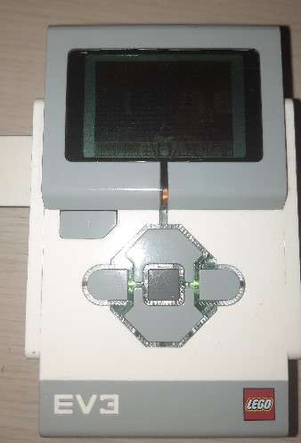
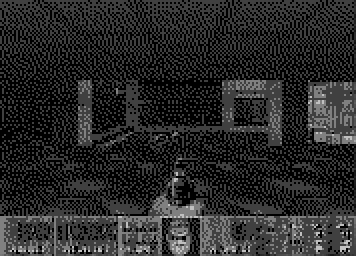

# EV3DOOM



**[Doomgeneric](https://github.com/ozkl/doomgeneric) based port to Mindstorms EV3 bricks running [EV3DEV](https://www.ev3dev.org)**

# Running
1. Download latest [release](https://github.com/Seva167/ev3doom/releases/latest)
2. Copy your doom .wad file to the brick
3. Copy executable file to the brick
4. Run it on the brick via SSH! ``$ ./ev3doom``

# Performance
**It actually runs pretty good!**

But dithering algorithm used for improving image quality has a bit of floats on non hardware accelerated system.

You can disable it by passing ```CFLAGS+=-DNO_DITHER``` to make while building from source

# Building
Install cross compiler (because compiling on the brick is painfully slow)
```
$ sudo apt install arm-linux-gnueabi-gcc
```
Build
```
$ make
```

# What about sound??
Sound works with SDL library but degrades performance (especially music)
## Building with sound support
I haven't tried to cross-compile it with SDL library so this readme is for compiling on the brick

Install GCC
```
$ sudo apt install gcc
```
Install SDL2
```
$ sudo apt install libsdl2-dev
$ sudo apt install libsdl2-mixer-dev
```
Build with sound support
```
$ make -f Makefile.snd
```
Music or sfx can be disabled
```
$ ./ev3doom -nomusic -nosfx
```
